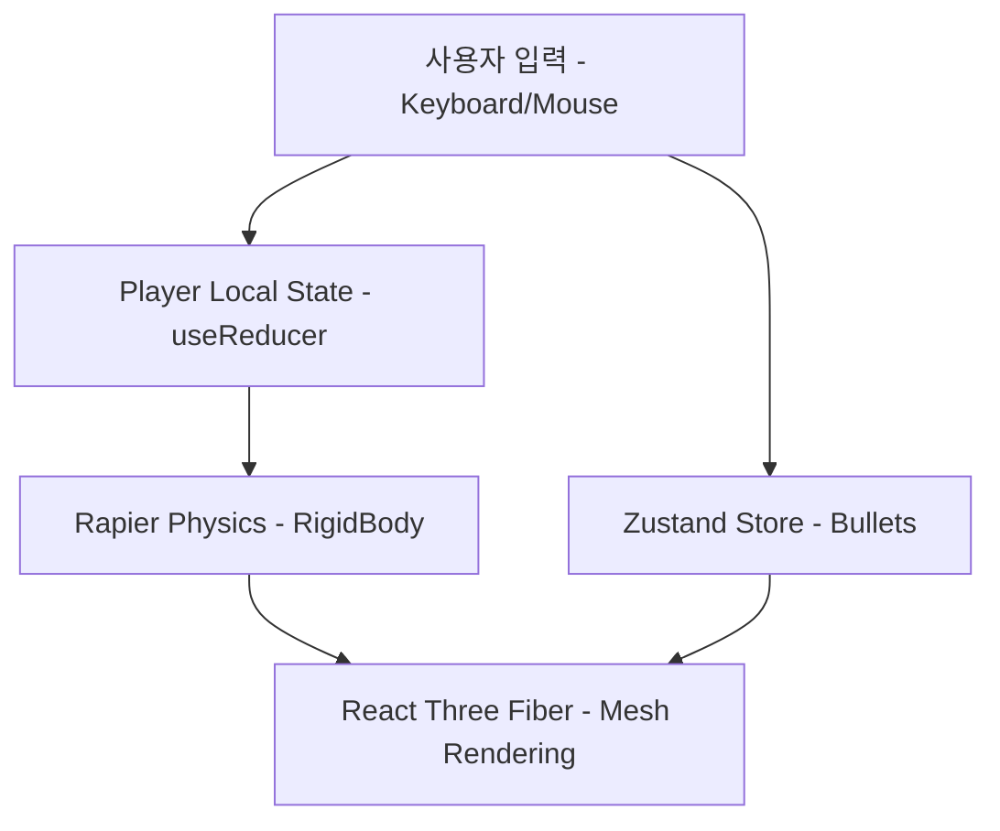

# 🏗️ Architectural Overview (아키텍처 개요)

이 프로젝트는 **Next.js** 환경에서 **React Three Fiber(R3F)**와 **Rapier** 물리 엔진을 결합한 고성능 3D 웹 배틀로얄 게임입니다.

## 🛠️ 기술 스택과 역할

| 기술               | 역할                               | 비고                        |
| :----------------- | :--------------------------------- | :-------------------------- |
| **Next.js**        | 프로젝트 구조 및 라우팅            | App Router 사용             |
| **Three.js / R3F** | 3D 렌더링 및 씬(Scene) 구성        | 선언적 3D 프로그래밍        |
| **Rapier**         | 물리 시뮬레이션 (중력, 충돌, 속도) | `react-three-rapier` 사용   |
| **Zustand**        | 전역 상태 관리 (총알, 게임 정보)   | 단순하고 빠른 상태 업데이트 |
| **Elysia.js**      | 고성능 백엔드 서버                 | Bun 런타임 최적화           |

## 🔄 핵심 데이터 흐름

### 1. 진입점: `client/app/page.tsx`

- 게임의 메인 캔버스(`Canvas`)가 생성됩니다.
- `<Physics>` 컴포넌트가 물리 시뮬레이션 영역을 정의하며, 그 안에 `Player`, `Ground`, `BulletManager` 등이 위치합니다.

### 2. 물리-모델-UI 연동

- 모든 동적 오브젝트(플레이어, 총알)는 `RigidBody`를 가집니다.
- **물리 엔진**이 매 프레임 위치와 물리량을 계산하면, **R3F**가 이를 시각적으로 렌더링합니다.
- 복잡한 상태 변화는 `useFrame` 훅 내부에서 매 초 60번(60fps)씩 계산되어 반영됩니다.
