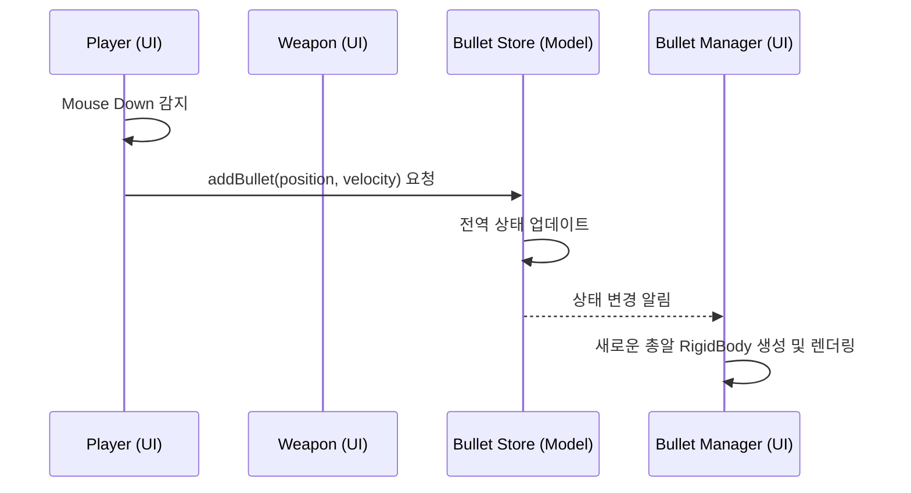

# 🧩 Entities (엔티티 시스템)

이 프로젝트는 기능을 독립적으로 관리하기 위해 모든 핵심 요소(Player, Weapon, Bullet 등)를 **엔티티(Entity)** 단위로 분리하여 관리합니다.

## `model` vs `ui` 구조

각 엔티티 디렉토리는 기본적으로 `model/`과 `ui/` 폴더를 가집니다.

- **`model/`**: 데이터 구조(Interface), 상태 관리(Zustand), 비즈니스 로직(Pure Functions)을 정의합니다.
- **`ui/`**: React Three Fiber 컴포넌트, 스타일링, 프레임 단위의 애니메이션을 정의합니다.

> [!TIP]
> 로직과 표현을 분리함으로써, 3D 모델이 바뀌거나 UI 라이브러리가 바뀌어도 핵심 로직은 그대로 유지할 수 있습니다.

## 주요 엔티티

### 1. Player (`entities/player`)

- **Model**: `PlayerState`(이동 속도, 점프 여부 등)와 `PlayerAction`을 정의합니다.
- **UI**: 플레이어의 메쉬(Mesh)와 물리 엔진(`RigidBody`)을 연동하며, 카메라 시점 제어를 담당합니다. `useReducer`를 사용하여 로컬 상태를 관리합니다.

### 2. Weapon (`entities/weapon`)

- **Model**: 무기의 종류(`WeaponType`), 데미지, 연사력 등을 정의합니다.
- **UI**: 무기의 3D 모델(`.glb`)을 로드하고, 카메라 모드(1인칭/3인칭)에 따라 무기의 위치와 회전값을 동적으로 보정합니다.

### 3. Bullet (`entities/bullet`)

- **Model**: `useBulletStore`(Zustand)를 통해 생성된 모든 총알의 위치와 속도를 전역적으로 관리합니다.
- **UI**: `BulletManager`가 스토어의 데이터를 읽어 실제 물리 객체(`RigidBody`)로 생성하고 관리합니다.

## 엔티티 간 상호작용 (Shooting Flow Example)

